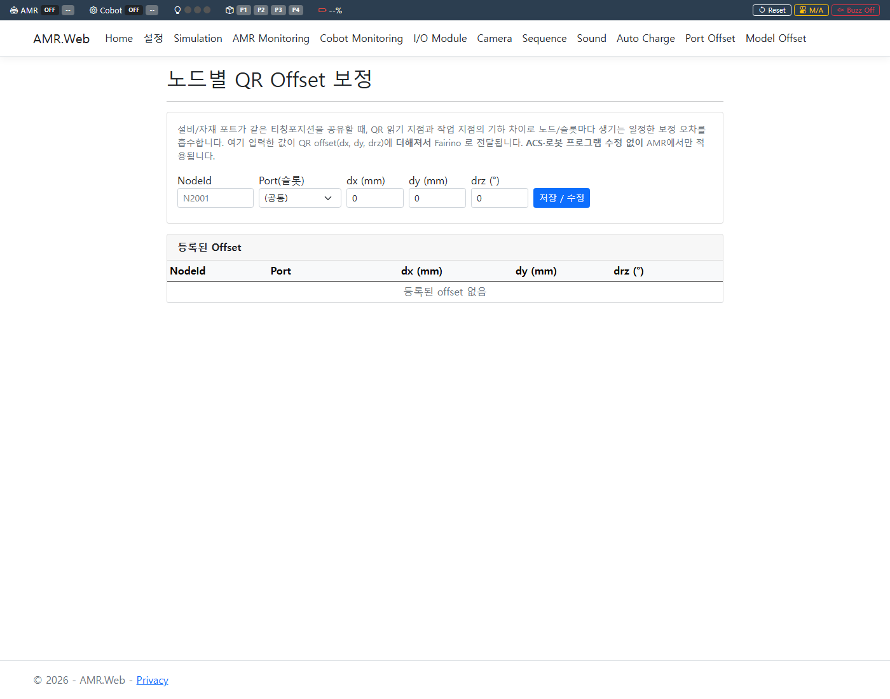
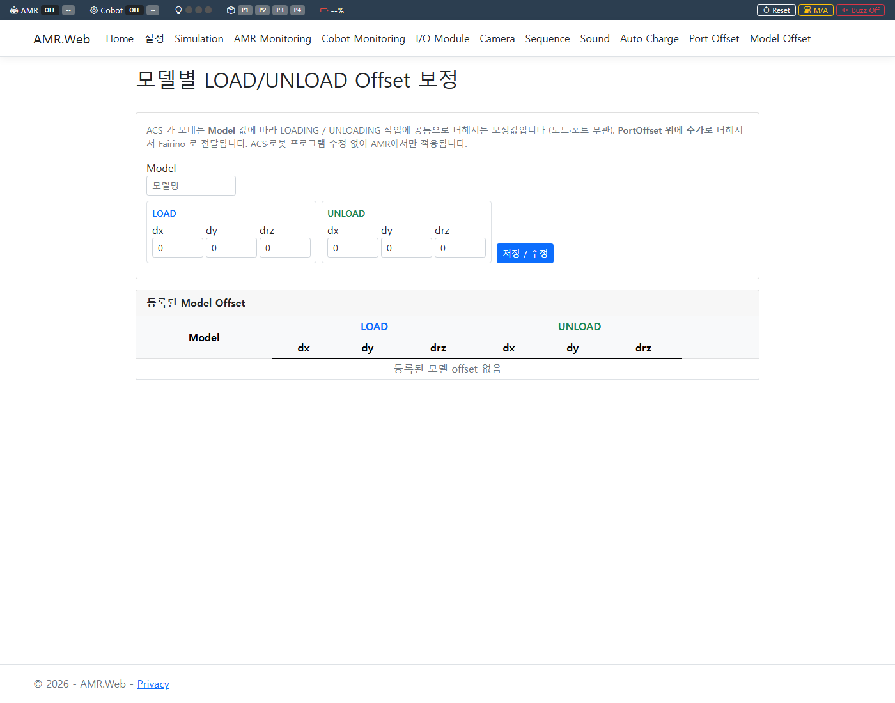
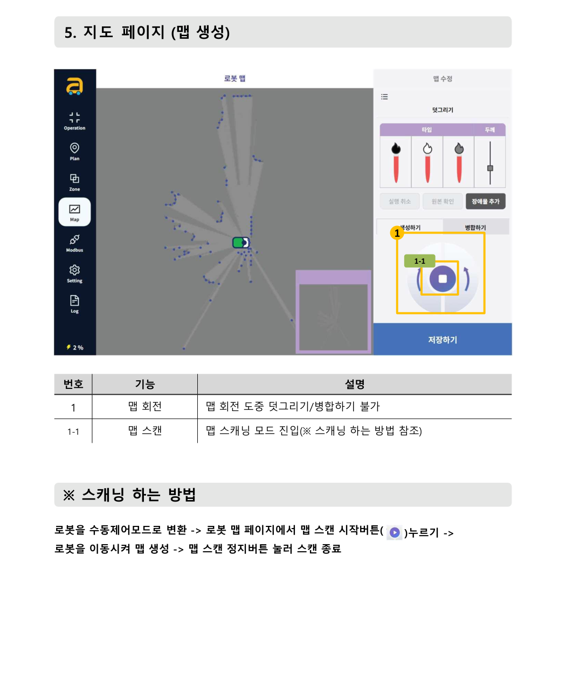
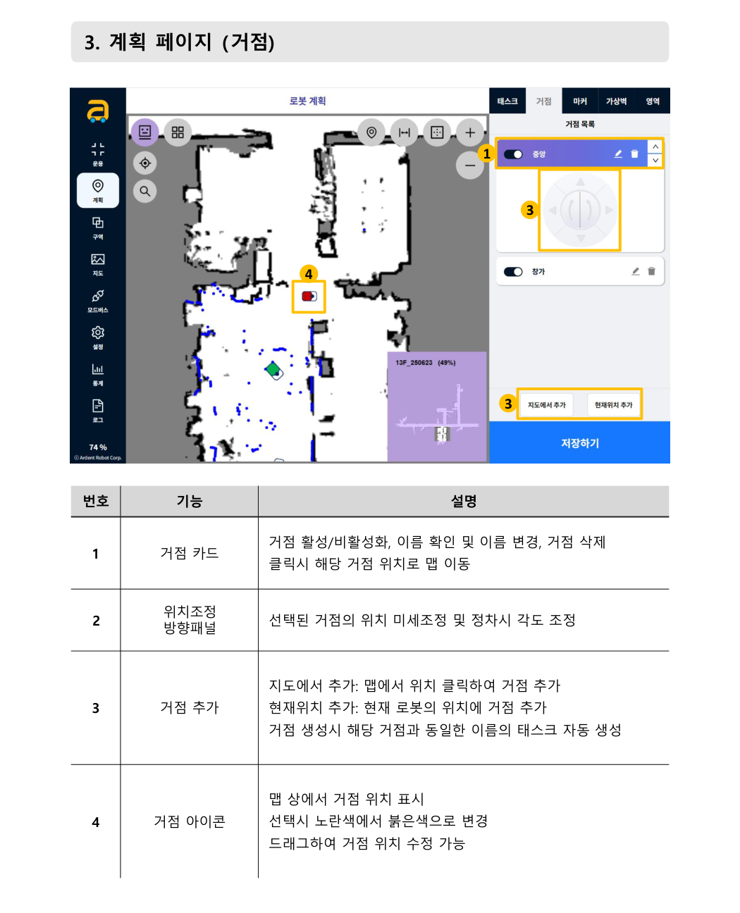
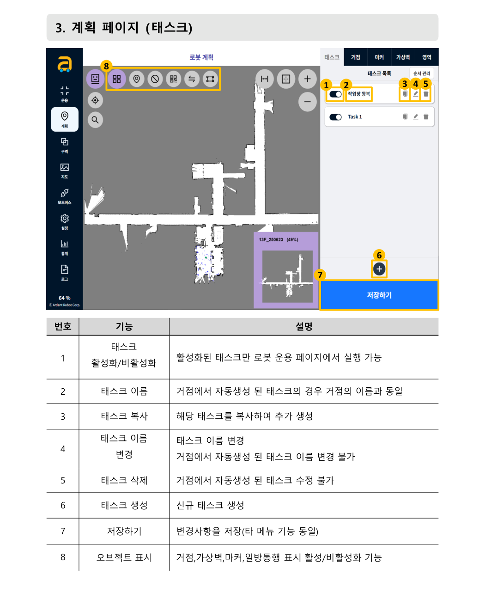
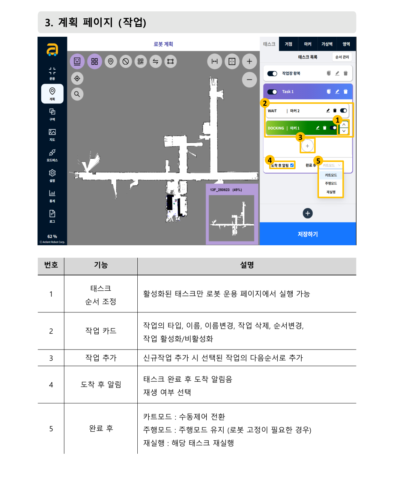
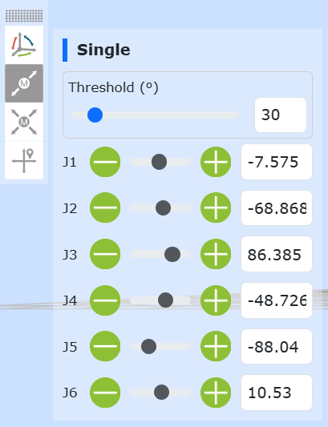
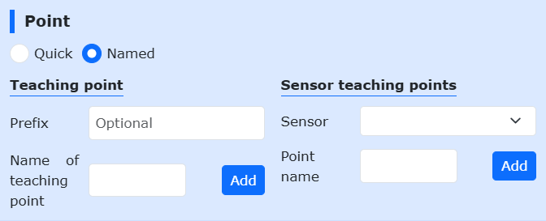
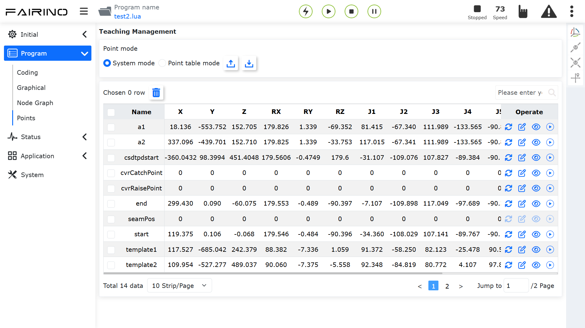

# NAMUGA AMR 사용자 매뉴얼

> 자율주행 이동로봇(AMR) 관리 시스템 — 운영자용 사용 설명서
> 접속 주소: **http://localhost:5200**

---

## 목차

1. [시스템 개요](#1-시스템-개요)
2. [프로그램 실행 확인과 접속](#2-프로그램-실행-확인과-접속)
3. [화면 공통 — 상단 상태 표시줄](#3-화면-공통--상단-상태-표시줄)
4. [Offset 보정 화면 사용법](#4-offset-보정-화면-사용법)
5. [새로운 설비(거점) 추가하기](#5-새로운-설비거점-추가하기)
   - [5.1 전체 절차 개요](#51-전체-절차-개요)
   - [5.2 이노로보틱스 AMR — 거점 세팅](#52-이노로보틱스-amr--거점-세팅)
   - [5.3 제어 SW — 위치 태그 매핑 등록](#53-제어-sw--위치-태그-매핑-등록)
   - [5.4 페어리노 Cobot — 티칭포인트 잡기](#54-페어리노-cobot--티칭포인트-잡기)
   - [5.5 페어리노 Cobot — 티칭포인트 수정·리셋](#55-페어리노-cobot--티칭포인트-수정리셋)
   - [5.6 카메라 티칭·오프셋 보정](#56-카메라-티칭오프셋-보정)
   - [5.7 시퀀스 테스트](#57-시퀀스-테스트)
6. [경광등·알람 상태 읽는 법](#6-경광등알람-상태-읽는-법)
7. [문제 해결](#7-문제-해결)

---

## 1. 시스템 개요

NAMUGA AMR은 상위 관제 시스템(ACS)의 지시를 받아 **매거진(자재 트레이)을 자동으로 이송**하는 시스템입니다. 하나의 PC에서 다음 장비를 통합 제어합니다.

- **AMR** — 자율주행 대차 (지정 위치로 이동)
- **Cobot** — 협동로봇 팔 (매거진 집기/놓기)
- **카메라** — QR 코드 인식으로 위치를 정밀 보정
- **경광등·부저·센서** — 상태 표시 및 안전

**작업 흐름 한눈에:**

```
ACS 지시(이동 명령) ─▶ AMR 이동 ─▶ 카메라 QR 보정 ─▶ Cobot이 매거진 집기/놓기 ─▶ 완료 보고 ─▶ 대기
```

---

## 2. 프로그램 실행 확인과 접속

프로그램은 **PC 부팅 시 자동으로 실행**됩니다. 별도의 조작은 필요 없습니다.

### 정상 실행 확인

- 부팅 후 약 30초 뒤 **터미널(검은 콘솔) 창**이 자동으로 뜹니다. 이 창이 떠 있으면 프로그램이 정상 동작 중입니다.
- ⚠️ **이 터미널 창을 닫으면 프로그램이 종료됩니다. 닫지 마세요.** (최소화는 괜찮습니다)

### 웹 화면 접속

| 접속 위치 | 주소 |
|-----------|------|
| AMR PC에서 | **http://localhost:5200** |
| 같은 네트워크의 다른 PC에서 | http://<AMR PC의 IP>:5200 |

> 자동 실행이 안 될 때는 [7. 문제 해결](#7-문제-해결)을 참고하세요.

---

## 3. 화면 공통 — 상단 상태 표시줄

모든 화면 맨 위에는 **상태 표시줄**이 고정되어 있으며, **2초마다 자동 갱신**됩니다.


| 표시 | 의미 |
|------|------|
| **AMR** | 대차 상태 (Started=초록 / Paused=노랑 / OFF=회색) 및 작업 상태(Moving 등) |
| **Cobot** | 로봇팔 모드(Auto=초록 / Manual=노랑)와 프로그램(Run=초록 / Stop=빨강) |
| **경광등 아이콘** | 초록/노랑/빨강 램프의 현재 점등 상태 |
| **P1~P4** | AMR의 매거진 감지 (초록=있음, 회색=없음) |
| **배터리 %** | 잔량 (초록>40% / 노랑 10~40% / 빨강<10%) 및 충전 여부 |

오른쪽의 제어 버튼:

| 버튼 | 기능 |
|------|------|
| **Reset** | 코봇 복구 (에러 클리어 후 Auto 복귀) — 확인 후 실행 |
| **M/A** | Cobot Manual ↔ Auto 모드 토글 — 확인 후 실행 (티칭 작업 시 사용) |
| **Buzz Off** | 부저 즉시 끄기 |

---

## 4. Offset 보정 화면 사용법

QR을 읽는 지점과 실제 작업 지점의 위치 차이를 소프트웨어로 보정합니다.
**ACS나 로봇 프로그램을 수정하지 않고** 제어 SW에서만 미세 위치를 조정할 수 있습니다.

> **최종 위치 보정 = QR 인식값 + Port Offset + Model Offset**

### 4.1 Port Offset (`/PortOffset`) — 노드·포트별 보정



- **NodeId** 와 **Port/슬롯**(공통 / LEFT / RIGHT)을 지정하고 **dx, dy, drz**(mm/도) 보정값을 입력해 **저장**합니다.
- 여기에 입력한 값이 QR 보정값에 더해져 로봇으로 전달됩니다.
- 표에서 행별 **편집 / 삭제** 가능.
- **사용 요령:** 처음엔 0으로 두고 시험 작업을 해본 뒤, 어긋난 만큼 값을 입력 → 재시험을 반복합니다.

### 4.2 Model Offset (`/ModelOffset`) — 제품 모델별 보정



- ACS가 보내는 **모델(제품 종류)별**로 **LOAD / UNLOAD** 각각의 dx, dy, drz 보정값을 입력해 저장합니다.
- 노드·포트와 무관하게 적용되며, **Port Offset 위에 추가로 더해집니다.**
- 표에서 행별 **편집 / 삭제** 가능.

---

## 5. 새로운 설비(거점) 추가하기

새 설비(포트)를 AMR 작업 대상으로 추가하려면 **이노로보틱스 AMR(거점·태스크) → 제어 SW(매핑) → 페어리노 Cobot(티칭포인트) → 카메라/오프셋 → 테스트** 순서로 작업합니다.

> 본 장의 AMR 관련 내용은 **이노로보틱스 AMR 사용설명서**, 페어리노 관련 내용은 **FAIRINO 협동로봇 사용자 매뉴얼**(https://manual.fairino.support)에서 발췌·요약했습니다. 세부 화면은 장비 SW 버전에 따라 다를 수 있습니다.

### 5.1 전체 절차 개요

```
① 이노로보틱스 AMR    ② 제어 SW           ③ 페어리노 Cobot      ④ 제어 SW            ⑤ 테스트
거점·태스크 등록   →   위치 태그 매핑   →   티칭포인트 기록   →   카메라 QR 티칭    →   Sequence 화면
(+필요시 맵/마커)      (NodeId↔Task/Job)     (QR·PICK·PLACE)       Port Offset 보정      LOAD/UNLOAD 검증
```

| 단계 | 작업 위치 | 필요한 것 |
|------|-----------|-----------|
| ① 거점 세팅 | AMR 컨트롤 페이지 (태블릿/웹) | 새 설비 앞 정차 위치, (필요시) 마커 |
| ② 매핑 등록 | 제어 SW `/Settings` | NodeId, Task/Job Index |
| ③ 티칭포인트 | 페어리노 WebApp | QR 스캔·PICK·PLACE 위치 |
| ④ 보정 | 제어 SW `/Camera`, `/PortOffset` | QR 부착 상태 |
| ⑤ 검증 | 제어 SW `/Sequence` | 매거진 |

### 5.2 이노로보틱스 AMR — 거점 세팅

이노로보틱스 AMR의 **컨트롤 페이지**에 접속해 작업합니다. 컨트롤 페이지는 ①로봇 운용 ②로봇 계획(태스크/거점/마커/가상벽) ③존 ④로봇 맵 ⑤모드버스 ⑥로봇 설정 등의 메뉴로 구성됩니다.

#### (1) 맵 준비 — 새 설비가 기존 맵 범위 밖일 때만



1. **운용 페이지 → 수동제어**로 로봇을 수동제어(카트) 모드로 전환합니다.
2. **지도 페이지(로봇 맵) → 맵 스캔 시작** 버튼을 누릅니다.
3. 로봇을 밀어 새 구역을 천천히 이동하며 라이다로 스캔합니다.
4. **맵 스캔 정지** 버튼으로 스캔을 종료하고, 맵 이름을 입력해 **저장**합니다.
5. 기존 맵에 일부만 추가할 때는 **맵 편집(덧그리기)** — 검은색 붓=벽(통행 불가), 하얀색 붓=길(통행 가능), 회색=지우기 — 또는 **맵 병합** 기능을 사용합니다.

#### (2) 거점(정차 위치) 추가 — 계획 페이지 > 거점



1. 거점 추가 방법 두 가지:
   - **지도에서 추가** — 맵에서 원하는 위치를 클릭해 거점 생성
   - **현재위치 추가** — 로봇을 실제 설비 앞 정차 위치에 세워 두고 현재 로봇 위치로 거점 생성 (**정확도가 좋아 권장**)
2. **위치조정 방향패널**로 거점의 위치와 **정차 시 각도**를 미세 조정합니다.
3. 거점 아이콘을 드래그해 위치를 수정할 수도 있습니다.
4. ⭐ **거점 생성 시 같은 이름의 태스크가 자동 생성**됩니다.

#### (3) 정밀 정차가 필요하면 — 마커 등록 (계획 페이지 > 마커)

| 마커 타입 | 용도 |
|-----------|------|
| QR 타입 | QR 코드로 위치 보정 (인식범위·유효일치율·인식번호 설정) |
| L 타입 | L자 구조물 기준 정밀 정차 (마커 길이·좌우 위치 설정) |
| V 타입 | V자 구조물 기준 정밀 정차 — **충전기 도킹에 사용** |

#### (4) 태스크(작업 순서) 구성 — 계획 페이지 > 태스크



1. **태스크 생성**으로 새 태스크를 만들거나, 거점 생성 시 자동 생성된 태스크를 사용합니다.
   (자동 생성된 태스크는 이름 변경/수정 불가 — 복잡한 동작이 필요하면 별도 태스크를 새로 만드세요)
2. 태스크 안에 **작업(Job)** 을 순서대로 추가합니다.



주요 작업 타입:

| 작업 타입 | 설명 | 주요 설정 |
|-----------|------|-----------|
| **waypoint (거점)** | 지정 거점으로 자율주행 | 목적지, 가상벽, 정차 정밀도 |
| **docking (정밀정차 L/V)** | 마커 기준 정밀 정차 | 마커, 정차위치(출발/도착), 허용오차, 재시도 |
| **charge (충전)** | 충전기 도킹·충전 | V마커, 충전 목표량, 재시도 |
| **wait (대기)** | 시간/모드버스/영역 조건 대기 | 모드버스 대기: 홀딩 레지스터 주소·조건값 |
| **jog (단순제어)** | 직진/회전 미세 이동 | 속도, 거리/시간, 장애물 감지 |
| **set (변수설정)** | 홀딩 레지스터에 값 쓰기 | 주소, 변경값 |
| **via (경유지)** | 무정차 경유 이동 | 목적지, 정차 정밀도 |
| **subtask (서브태스크)** | 다른 태스크 호출 | 태스크 선택 |

3. ⚠️ **하단 저장 버튼을 꼭 누르세요.** 저장하지 않으면 다른 페이지로 이동할 수 없고, 앱 재실행 시 변경사항이 초기화됩니다.

#### (5) Task Index / Job Index 번호 확인

**모드버스 페이지**에서 방금 만든 태스크의 **Task Index / Job Index 번호**를 확인해 둡니다.
제어 SW는 이 번호를 Modbus로 기록해 이동을 지시합니다 (HR31=Task Index, HR32=Job Index, HR30=시작(2)).

### 5.3 제어 SW — 위치 태그 매핑 등록

1. 제어 SW **설정(`/Settings`) → 위치 태그 매핑**에서 새 행 추가:
   - **LocationTag**: ACS와 협의한 새 NodeId (예: `N0007`)
   - **TaskIndex / JobIndex**: 5.2-(5)에서 확인한 번호
   - **Description**: 설비 이름 등
2. 저장 후 해당 행의 **실행(Execute)** 버튼으로 AMR이 실제로 그 위치까지 이동하는지 확인합니다.
3. 정차 위치·방향이 어긋나면 AMR 거점의 위치/각도를 다시 조정합니다.

### 5.4 페어리노 Cobot — 티칭포인트 잡기

새 설비 포트에 대해 Cobot이 움직일 위치들을 티칭합니다.

#### (1) WebApp 접속과 준비

1. 페어리노 WebApp: 같은 네트워크 PC의 브라우저에서 **로봇 IP로 접속**합니다.
   (본 시스템 현장 설정: `10.10.100.201`, 페어리노 공장 기본값: `192.168.58.2`)
2. 티칭 전 **자동 시퀀스가 정지 상태인지** 확인하고, 제어 SW 상단 리본의 **M/A** 버튼으로 **Manual 모드**로 전환합니다.
3. 로봇 주변 안전을 확보합니다 (협동로봇이라도 티칭 중 접근 주의).

#### (2) 로봇을 원하는 위치로 이동 (조그)



- **Base Jog** — 베이스 좌표계 X/Y/Z/RX/RY/RZ 버튼을 **길게 눌러** 이동
- **Joint Jog** — 관절(J1~J6) 단위 이동: 좌우 원형 버튼 또는 슬라이더 (위 그림)
- **Tool Jog** — 툴 좌표계 기준 이동 (그리퍼 방향 기준 미세 조정에 유용)
- **드래그 티칭** — 로봇 끝단을 손으로 잡고 직접 위치를 잡는 방법

#### (3) 티칭포인트 기록



1. 로봇을 목표 자세로 만든 뒤, WebApp의 **Point(티칭포인트 기록)** 영역에서
2. **Named**(이름 지정)를 선택하고 포인트 이름을 입력한 후 **Add(저장)** 를 누릅니다. ("Save point successful" 확인)
   - Quick(빠른 기록, 자동 이름)도 가능하지만, **의미 있는 이름을 직접 지정**하는 것을 권장합니다.
   - 포인트 좌표계는 저장 시점의 로봇 애플리케이션 좌표계로 저장됩니다.

#### (4) 이 시스템에서 티칭이 필요한 포인트 (DI 매핑)

본 시스템의 Cobot 프로그램은 제어 SW가 보내는 **DI 신호 번호**에 따라 티칭포인트로 이동합니다. **새 설비(포트) 추가 시 아래 위치들을 티칭**해야 합니다:

| DI | 위치 | 새 설비 추가 시 |
|----|------|----------------|
| DI16 | **설비포트 QR 스캔 위치** | 설비포트면 필수 — 카메라가 QR을 정면으로 볼 것 |
| DI17 | **자재포트 QR 스캔 위치** | 자재포트면 필수 |
| DI8~9 | 설비포트 PLACE 슬롯1~2 (LEFT/RIGHT) | 설비포트면 필수 |
| DI10~11 | 설비포트 PICK 슬롯1~2 (LEFT/RIGHT) | 설비포트면 필수 |
| DI12~13 | 자재포트 PLACE 슬롯1~2 (LEFT/RIGHT) | 자재포트면 필수 |
| DI14~15 | 자재포트 PICK 슬롯1~2 (LEFT/RIGHT) | 자재포트면 필수 |
| DI20~23 | 자재포트 슬롯 확인 위치 (깊이 감지) | 자재포트면 필수 |
| DI0~3 | AMR PICK 슬롯1~4 | 기존 티칭 재사용 (변경 불필요) |
| DI4~7 | AMR PLACE 슬롯1~4 | 기존 티칭 재사용 |
| DI25 | Home 위치 | 기존 티칭 재사용 |

> 티칭포인트 이름과 DI 번호의 연결은 Cobot 메인 프로그램(Lua)에 정의되어 있습니다. **새 포인트 이름은 로봇 프로그램 담당자와 협의된 명명 규칙**을 따르거나, 기존 포인트를 재티칭(5.5)하는 방식으로 작업하세요.

#### (5) 티칭 후 검증과 복귀

1. 제어 SW **Cobot Monitoring(`/CobotMonitoring`) 화면**에서 해당 DI를 수동으로 ON 하여 로봇이 새 티칭 위치로 정확히 이동하는지 확인합니다 (DO0 Busy → DO1 Complete 확인).
2. 확인이 끝나면 상단 리본 **M/A**로 **Auto 모드 복귀**, 메인 프로그램 **Run** 상태를 확인합니다.

### 5.5 페어리노 Cobot — 티칭포인트 수정·리셋

기존 포인트가 어긋났거나 설비 위치가 바뀌었을 때 재티칭하는 방법입니다.

#### 티칭포인트 목록 확인 — Program → Points



- WebApp **Program → Points** 메뉴: 저장된 모든 티칭포인트를 목록으로 확인하고 이름으로 검색할 수 있습니다.

#### 방법 1 — 현재 위치로 재기록 (권장)

1. 조그/드래그 티칭으로 로봇을 **새 위치**로 이동
2. **같은 이름으로 포인트를 다시 저장**(덮어쓰기)

#### 방법 2 — 좌표값 직접 수정

1. **Program → Points**에서 대상 포인트 선택
2. x, y, z, rx, ry, rz, v 값을 수정
3. **왼쪽 파란 체크박스를 체크**한 뒤 **Modify** 클릭
4. ⚠️ 수정값이 로봇 작업 범위를 벗어나지 않도록 주의

#### 삭제·백업

- **삭제**: 포인트 선택 후 **Delete** 버튼
- **백업/복원**: Points 화면 상단의 **내보내기(Export)/가져오기(Import)** 버튼으로 티칭포인트 파일 백업 지원 — **변경 전 Export로 백업해 두는 것을 권장**합니다.

#### 재티칭 후 반드시 할 일

1. 해당 포인트를 사용하는 동작을 **Cobot Monitoring에서 DI 수동 테스트**
2. QR 스캔 위치(DI16/17)를 바꿨다면 → **카메라 QR 티칭**(5.6)과 **Port Offset**을 다시 확인
3. **Auto 모드 복귀** 후 시퀀스 테스트(5.7)

### 5.6 카메라 티칭·오프셋 보정

1. 제어 SW **Camera(`/Camera`) 화면**: Cobot을 QR 스캔 위치로 보낸 상태에서 새 포트의 QR이 인식되는지 확인 → **Teaching 저장**으로 기준 위치 저장.
2. **Port Offset(`/PortOffset`) 화면**: 새 NodeId + Port(LEFT/RIGHT/공통)의 dx·dy·drz 보정값 등록 ([4.1](#41-port-offset-portoffset--노드포트별-보정) 참조).
3. 제품 모델별 차이가 있으면 **Model Offset(`/ModelOffset`)** 에 LOAD/UNLOAD 보정값 등록 ([4.2](#42-model-offset-modeloffset--제품-모델별-보정) 참조).

### 5.7 시퀀스 테스트

1. 제어 SW **Sequence(`/Sequence`) 화면**에서 새 NodeId + JobType(LOAD/UNLOAD) + PortType + Port를 지정하고 **Start Sequence**.
2. **실행 로그**로 단계별 진행을 확인하며 점검:
   - 도착 정차 위치/각도가 일정한가
   - QR 인식 성공, Delta 값이 안정적인가 (편차가 크면 QR 부착·조명 확인)
   - Pick/Place 시 간섭·낙하가 없는가 → 어긋나면 Port Offset 미세 조정
3. LOAD/UNLOAD 각각 수 회 반복하여 재현성을 확인합니다.
4. 마지막으로 **ACS에서 실제 moveCmd**를 보내 전체 연동을 확인합니다.

---

## 6. 경광등·알람 상태 읽는 법

### 6.1 경광등 색상의 의미 (우선순위: 빨강 > 노랑 > 초록)

| 상태 | 초록 | 노랑 | 빨강 | 부저 |
|------|:---:|:---:|:---:|:---:|
| 대기(정상) / 작업 정상 완료 | ON | ON | OFF | OFF |
| 이동 중 / 작업 진행 중 | ON | OFF | OFF | OFF |
| 배터리 30% 이하 | ON | 점멸 | OFF | OFF |
| 작업 실패 / 비상정지(EMO) | OFF | OFF | ON | ON |
| 통신 끊김 (AMR/Cobot/I/O) | OFF | OFF | ON | OFF |
| 타임아웃 (도착 대기 등) | OFF | OFF | ON | ON |

- **빨강 + 부저**가 켜지면 이상 상태입니다. **리셋 스위치를 짧게** 누르면 부저가 꺼지고 이상이 해제됩니다.
- 통신 끊김은 부저 없이 빨강만 켜집니다.

### 6.2 리셋 스위치 조작

| 조작 | 동작 |
|------|------|
| **짧게 누름 (5초 미만)** | 코봇 자동 복구 + 에러 해제 |
| **길게 누름 (5초 이상)** | 강제 복구 — 결함 해제 후 정지 및 Manual 전환 (운전자 개입) |

### 6.3 주요 알람

| 코드 | 의미 | 확인 사항 |
|------|------|-----------|
| ERR-100 | Cobot 준비 안 됨 | Cobot 연결/모드(Auto)/메인프로그램 |
| ERR-101 | AMR 준비 안 됨 | AMR 연결 상태 |
| ERR-102 | 카메라 준비 안 됨 | 카메라 연결 |
| ERR-103 | Cobot 충돌 감지 | 주변 장애물 제거 후 복구 |
| ERR-104 | AMR 맵 인식 오류 | 맵 일치율 낮음 — 주변 환경 확인 |
| ERR-105 | 매거진 수동 제거 | 운행 중 매거진이 빠짐 |

---


## 부록 A. 사무실 시뮬레이션 테스트 (실장비 없이)

Sequence 화면 상단 **🖥️ 시뮬레이션 모드** 카드에서 **[모드 ON]** 을 켜면 AMR 이동·Cobot 동작이 **[동작 완료]** 버튼 대기로 바뀌고, 슬롯 센서는 화면의 가상 상태를 사용합니다. ACS 와는 실제 MQTT 로 통신하며, status(pose)와 reply 도 그대로 발행됩니다.

**Exchange (v0.3) 테스트 순서** — ACS 가 구간별로 지시하는 순서와 동일:

1. `moveCmd UNLOAD` (픽업지, AMR Slot=투입슬롯 1|2) → 동작 완료 반복 → COMPLETED
2. `moveCmd EXCHANGE` (설비, PortType=EQP) → 도착 → ARRIVED·COMPLETED → **ExchangeDocked** 대기
3. ActionCmd **Type=UNLOAD**, AMR Slot=회수슬롯(3|4) → OLD 취출 → COMPLETED(step 30)
4. ActionCmd **Type=LOAD**, AMR Slot=투입슬롯(1|2) → NEW 투입 → COMPLETED(step 40)
5. `moveCmd LOAD` (반납지, AMR Slot=회수슬롯) → 하역 → COMPLETED

> 설정 → 위치 태그 매핑에 각 노드의 **좌표(X/Y/Angle)** 를 입력해 두면, 이동 완료 시 status pose 가 해당 좌표로 갱신되어 ACS 의 좌표 기반 도착 판정도 검증할 수 있습니다.

## 7. 문제 해결

| 증상 | 원인 | 조치 |
|------|------|------|
| 부팅 후 터미널 창이 안 뜸 (자동 실행 안 됨) | 작업 스케줄러 문제 | 작업 스케줄러에서 "AMR Auto Start" 작업 상태 확인, `Logs\autostart\` 로그 확인 |
| 웹 접속이 안 됨 | 프로그램 미실행 / 포트 사용 중 | 터미널 창 확인. 포트 5200 점유 시 `netstat -ano \| findstr 5200` |
| 상태 표시줄이 모두 OFF/미연결 | 장비 통신 끊김 | 각 장비 IP·전원·네트워크 확인 (5초마다 자동 재연결됨) |
| MQTT 연결 실패 | RabbitMQ 정지 | `Get-Service RabbitMQ` 로 서비스 상태 확인 |
| 이동 명령이 거부됨 (매핑 없음) | 위치 태그 미등록 | 설정 화면에서 해당 NodeId 매핑 추가 ([5.3](#53-제어-sw--위치-태그-매핑-등록) 참조) |
| 이동 명령이 거부됨 (작업 중) | 다른 작업 수행 중 | 현재 작업 완료 또는 Abort 후 재시도 |
| Cobot이 움직이지 않음 | Manual 모드 | 상단 **M/A** 버튼으로 Auto 전환 |
| 경광등 빨강 지속 | 통신 끊김 / 비상정지 / 작업 실패 | 원인 확인 후 리셋 스위치(짧게) |
| Pick/Place 위치가 어긋남 | 오프셋/티칭 어긋남 | Port Offset 미세 조정 ([4.1](#41-port-offset-portoffset--노드포트별-보정)), 심하면 재티칭 ([5.5](#55-페어리노-cobot--티칭포인트-수정리셋)) |

> **로그 확인:** 실행 폴더의 `Logs\log-<날짜>.txt` 에 상세 로그가 일 단위로 기록됩니다(30일 보관).

---

*본 매뉴얼은 웹 화면 사용과 운영을 위한 안내서입니다. ACS 연동 상세 사양(MQTT 메시지 규격 등)은 `docs` 폴더의 인터페이스 문서를 참고하세요.*
